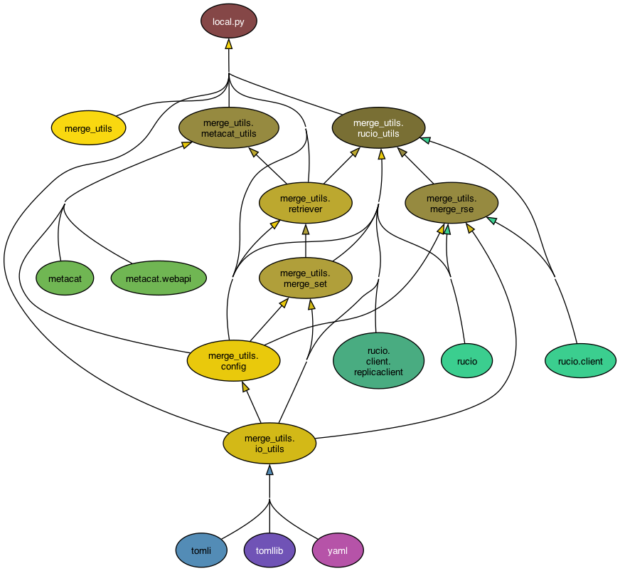
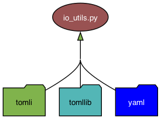
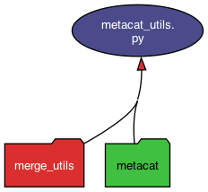
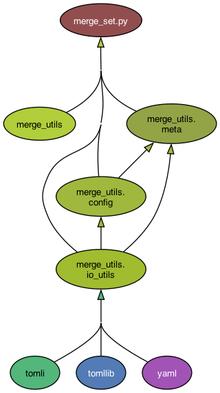
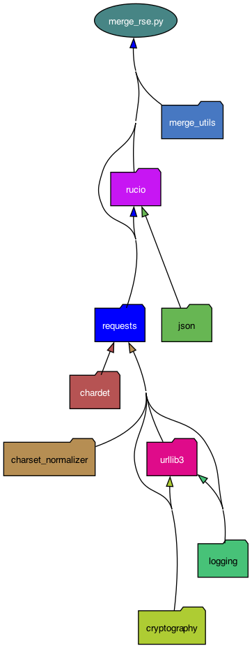
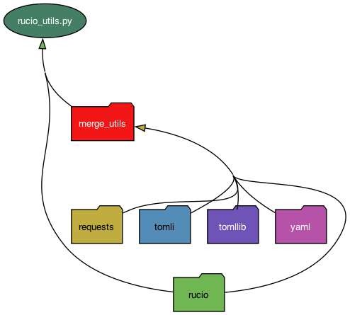
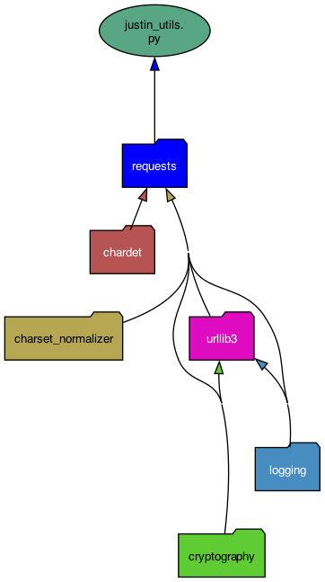

Installation and Startup
========================

Installation
------------

To install the official DUNE version (until we add to spack)

First make a virtual environment and activate it.

.. code-block:: bash
    
    # note, this ends up in the directory you invoke the venv in
    python3 -m venv .merging
    . .merging/bin/activate

Then use spack (or ups) to set up a normal DUNE environment

(your setup script here)

Then download and install the merge-utils code in your virtual environment

.. code-block:: bash

    git clone https://github.com/DUNE/merge-utils.git
    cd merge-utils
    pip install -e .   # this makes an editable environment

.. note::

    .. code-block:: bash

        Note that the pip install gives error messages about incompatabilities with rucio.  It appears 

        ERROR: pips dependency resolver does not currently take into account all the packages that are installed. This behaviour is the source of the following dependency conflicts.
        rucio-clients 35.4.1 requires dogpile-cache>=1.2.2, but you have dogpile-cache 1.1.8 which is incompatible.
        rucio-clients 35.4.1 requires jsonschema>=4.20.0, but you have jsonschema 4.17.3 which is incompatible.
        rucio-clients 35.4.1 requires requests>=2.32.2, but you have requests 2.31.0 which is incompatible.
        rucio-clients 35.4.1 requires tabulate>=0.9.0, but you have tabulate 0.8.9 which is incompatible.

Testing
-------

You can check to see if it is set up by typing

.. code-block:: bash

    python3 -m pytest

Dependencies
------------

local.py 

----

io_utils.py

----

metacat_utils

----

merge_set

----

merge_rse

----

rucio_utils

----

justin_utils

